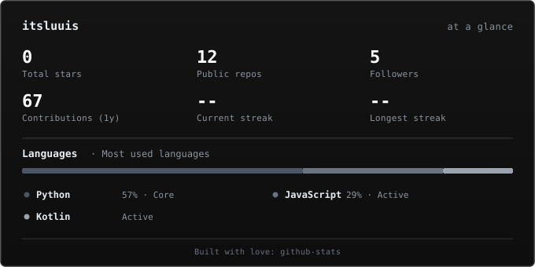

<!-- ========================================================================= -->
<!-- 1. TERMINAL HEADER BANNER                                                 -->
<!-- ========================================================================= -->
<picture>
  <source media="(prefers-color-scheme: dark)" srcset="assets/banner-dark.svg">
  <source media="(prefers-color-scheme: light)" srcset="assets/banner-dark.svg">
  
</picture>

  

<!-- ========================================================================= -->
<!-- 2. ANIMATED TYPEWRITER BANNER                                             -->
<!-- ========================================================================= -->

  

<!-- ========================================================================= -->
<!-- 3. SOCIAL BADGES & PROFILE VIEWS COUNTER                                  -->
<!-- ========================================================================= -->

&nbsp;&nbsp;

&nbsp;&nbsp;

---

<!-- ========================================================================= -->
<!-- 4. ABOUT ME / BIO                                                         -->
<!-- ========================================================================= -->
# [SYS.LOG] / Who am I?

> *"Frontend isn't just about rendering pixels; it's about crafting fluid human-machine interfaces that make complex systems feel effortless."*

Hello, My name is Luis Carlos but you can call me **Lu**.

I am a Computer Science and Software Engineer Student current in 2nd year, at the **University Jose Antonio Paez**, Venezuela.

I am a university student with certification in public speaking with practical experience in leading team projects and activities. Known for being curious, disciplined, and detail-oriented in seeing tasks through to completion, while maintaining clear, empathetic, and patient communication. Fluent in Spanish, English, and Portuguese, highly motivated to learn quickly and deliver practical solutions in dynamic environments.

Since I was a child I was always fascinated by the world of computers and how they work,
I started my journey when i was 13 with a few simple games in **Game Maker Studio 2 (GML2)**, Later on, I discovered a new brand of possibilities with other lenguajes but my real focus was on **Web Development** because i realy enjoy the time when i had to desing the style and identity of my games.

- **Current Directive**: Architecting and engineering an intuitive, high-performance **Personal Finance Application** focused on clear data visualization and user sovereignty.
- **Autonomous Learning**: Diving deep into **Mechatronics Fundamentals**, bridging software architecture with physical automation, sensors, and robotics.
- **Daily Drivers**: `TypeScript` • `Python` • `VS Code` • `Antigravity` • `Cosmos` • `Git`.
- **Mindset** Obsessed with clean architectures, system optimization, and compound personal growth.

<!-- ========================================================================= -->
<!-- 5. GITHUB METRICS & STATISTICS                                            -->
<!-- ========================================================================= -->
## numbers?

<!-- Tarjeta unificada generada por GitHub Actions (jstrieb/github-stats) -->
<picture>
  <source media="(prefers-color-scheme: dark)" srcset="generated/overview.svg">
  
</picture>

